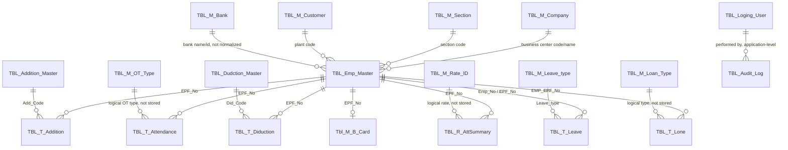

# Shinex HRIS Database Relational Model

This document describes the database model represented by the backend JPA
entities in `Backend/src/main/java/com/hsb/hris/entity`.

For a fresh local SQL Server database, use
[`database/phase1-schema.sql`](C:/Users/TharinduChathuranga/Desktop/Shinex/Backend/database/phase1-schema.sql).
It creates the Phase 1 master tables with primary keys, foreign keys, `bit`
flags, decimal financial fields, and a local BCrypt bootstrap account.

## Database platform and ownership

- Database: Microsoft SQL Server
- Default database: `Shinex`
- Default schema: `dbo`
- ORM: Spring Data JPA / Hibernate
- Schema management: `spring.jpa.hibernate.ddl-auto=none`

The application maps to an existing legacy schema. The entities do not declare
`@ManyToOne`, `@OneToMany`, or other JPA relationship annotations. Therefore,
the relationships below are logical relationships inferred from shared column
names and business meaning; they are not currently enforced or navigated by
Hibernate.

## Entity relationship diagram



The diagram shows intended business links. Several are not strict foreign
keys because the legacy tables use different column names, store descriptive
text instead of codes, or do not contain the referenced code at all.

## Table catalogue

### Master tables

| Entity | Physical table | Primary key | Main purpose |
| --- | --- | --- | --- |
| `BusinessCenter` | `TBL_M_Company` | `Company_ID` | Company/business-center master |
| `Plant` | `TBL_M_Customer` | `Cus_Code` | Customer or plant master |
| `Section` | `TBL_M_Section` | `Section_Code` | Employee section master |
| `Bank` | `TBL_M_Bank` | `Bank_ID` | Bank master |
| `AdditionMaster` | `TBL_Addition_Master` | `Addition_Code` | Addition type definitions |
| `DeductionMaster` | `TBL_Dudction_Master` | `Dud_Code` | Deduction type definitions |
| `LeaveType` | `TBL_M_Leave_type` | `Leave_Type` | Leave type definitions |
| `LoanType` | `TBL_M_Loan_Type` | `Loan_Type` | Loan type definitions |
| `OtType` | `TBL_M_OT_Type` | `OT_Type` | Overtime type and rate definitions |
| `RateId` | `TBL_M_Rate_ID` | `Rate_ID` | General payroll rate definitions |
| `LoginUser` | `TBL_Loging_User` | `Login_Name` | Login credentials and client business code |

### Core and transaction tables

| Entity | Physical table | Primary key | Main purpose |
| --- | --- | --- | --- |
| `Employee` | `TBL_Emp_Master` | `Emp_EPF_No` | Employee master record |
| `BCard` | `Tbl_M_B_Card` | `EPF_No` | Employee B-card lifecycle |
| `Attendance` | `TBL_T_Attendance` | `Attt_Year`, `Att_Month`, `EPF_No`, `Day_in` | Daily attendance and overtime |
| `TAddition` | `TBL_T_Addition` | `EPF_No`, `Add_Code` | Employee additions by type |
| `TDeduction` | `TBL_T_Diduction` | `EPF_No`, `Did_Code` | Employee deductions by type |
| `TLeave` | `TBL_T_Leave` | `Leave_ID` | Employee leave transactions |
| `TLoan` | `TBL_T_Lone` | `Lone_ID` | Employee loan records |
| `AttendanceSummary` | `TBL_R_AttSummary` | `Attt_Year`, `Att_Month`, `EPF_No` | Computed monthly payroll summary |
| `AuditLog` | `TBL_Audit_Log` | `id` identity | Change history and audit events |

## Table definitions

### `TBL_Emp_Master` — Employee

**Primary key:** `Emp_EPF_No` (`epfNo`, `String`, required).

Important columns:

- `Emp_NIC_No`, `Emp_Name`, `Emp_Nam1`, address and contact details
- `Emp_Plant_Code` — logical reference to `TBL_M_Customer.Cus_Code`
- `Emp_Section_Code` — logical reference to `TBL_M_Section.Section_Code`
- `Emp_Business_Center` — business-center value; currently stored as text
- Salary, allowance, bank, gender, and employment-date fields

### `TBL_M_Company` — Business center

**Primary key:** `Company_ID` (`companyId`, `String`, required).

Stores company identity, contact information, registration numbers, and
website. The frontend commonly exposes `Company_ID` as `code` and
`Company_Name` as `name`.

### `TBL_M_Customer` — Plant/customer

**Primary key:** `Cus_Code` (`custCode`, `String`, required).

Stores plant/customer identity, contact details, working days, overtime
calculation mode, minimum staff quantity, and attendance allowance settings.

### `TBL_M_Section` — Section

**Primary key:** `Section_Code` (`sectionCode`, `String`, required).

Stores the section code and name. Employees refer to the code through
`Emp_Section_Code`.

### `Tbl_M_B_Card` — B-card

**Primary key:** `EPF_No` (`epfNo`, `String`, required).

Stores B-card fill, registration, signature, and issue flags and dates.
`EPF_No` is intended to be a one-to-zero-or-one relationship with
`TBL_Emp_Master.Emp_EPF_No`.

### `TBL_M_Bank` — Bank

**Primary key:** `Bank_ID` (`bankId`, `String`, required).

Stores a bank code and name. Employee bank data is currently stored as
`Emp_Bank_Name` text rather than a normalized `Bank_ID` foreign key.

### Addition and deduction masters

`TBL_Addition_Master` uses `Addition_Code` as its primary key and defines
addition name, default value, EPF inclusion, basic-salary inclusion, and
other-addition flags.

`TBL_Dudction_Master` uses `Dud_Code` as its primary key and defines deduction
name, default amount, loan flag, uniform flag, and other-deduction flag.

### `TBL_M_Leave_type` and `TBL_M_Loan_Type`

`TBL_M_Leave_type` uses `Leave_Type` as its primary key and is logically
referenced by `TBL_T_Leave.Leave_type`.

`TBL_M_Loan_Type` uses `Loan_Type` as its primary key. `TBL_T_Lone` currently
has no loan-type column, so a database relationship cannot be formed from the
current entity mappings.

### `TBL_M_OT_Type` and `TBL_M_Rate_ID`

`TBL_M_OT_Type` uses `OT_Type` as its primary key and stores the overtime name
and rate. `TBL_T_Attendance` stores calculated overtime values but does not
store an `OT_Type` code.

`TBL_M_Rate_ID` uses `Rate_ID` as its primary key and stores a general rate
name and value. `TBL_R_AttSummary` stores calculated rate values but does not
store a `Rate_ID` code.

### `TBL_T_Attendance` — Daily attendance

**Composite primary key:**

```text
(Attt_Year, Att_Month, EPF_No, Day_in)
```

Logical references:

- `EPF_No` -> `TBL_Emp_Master.Emp_EPF_No`
- `Plant_Code` -> `TBL_M_Customer.Cus_Code`
- `Business_Center` -> business-center identity/value

Stores dates, in/out times, shifts, working hours, overtime, allowances,
meals, holidays, and salary calculation inputs.

### `TBL_R_AttSummary` — Monthly attendance/payroll summary

**Composite primary key:**

```text
(Attt_Year, Att_Month, EPF_No)
```

Logical references:

- `EPF_No` -> `TBL_Emp_Master.Emp_EPF_No`
- `Plant_Code` -> `TBL_M_Customer.Cus_Code`
- `Business_Center` -> business-center identity/value

This is a calculated/reporting table. It contains shift totals, overtime
totals, additions, deductions, EPF/ETF values, gross salary, and net salary.
The backend comments indicate that it should be treated as read-only from the
API.

### `TBL_T_Addition` — Employee additions

**Composite primary key:**

```text
(EPF_No, Add_Code)
```

Logical references:

- `EPF_No` -> `TBL_Emp_Master.Emp_EPF_No`
- `Add_Code` -> `TBL_Addition_Master.Addition_Code`

Stores amount, recurring-month flag, month, year, and business center.

### `TBL_T_Diduction` — Employee deductions

**Composite primary key:**

```text
(EPF_No, Did_Code)
```

Logical references:

- `EPF_No` -> `TBL_Emp_Master.Emp_EPF_No`
- `Did_Code` -> `TBL_Dudction_Master.Dud_Code`

The physical table and column names preserve legacy spelling (`Diduction`,
`Did_Code`, and `Add_Month`).

### `TBL_T_Leave` — Leave transaction

**Primary key:** `Leave_ID` identity.

Logical references:

- `Emp_No` -> `TBL_Emp_Master.Emp_EPF_No`
- `Leave_type` -> `TBL_M_Leave_type.Leave_Type`
- `Business_Center` -> business-center identity/value

Stores leave year/month, duration, start date, and end date.

### `TBL_T_Lone` — Loan transaction

**Primary key:** `Lone_ID`.

Logical references:

- `EMP_EPF_No` -> `TBL_Emp_Master.Emp_EPF_No`
- `Business_Unit` -> business-center or business-unit value

Stores loan amount, start date, end date, and duration. The entity currently
maps `Lone_End_Date` to `Double`, although the database column name indicates a
date; this should be verified against the actual SQL Server schema before
changing the mapping.

There is no `Loan_Type` column in this entity, so `TBL_M_Loan_Type` is not
currently connected to loan transactions.

### `TBL_Loging_User` — Login user

**Primary key:** `Login_Name`.

Stores password and `Client_Busness_Code`. The business code is an
application-level link to a business center/client value, but no JPA or
database foreign key is declared.

### `TBL_Audit_Log` — Audit log

**Primary key:** `id` identity.

Stores timestamp, performer, action (`CREATE`, `UPDATE`, or `DELETE`), module,
entity ID, and change details. `Performed_By` is a username value and is not a
declared foreign key to `TBL_Loging_User`.

## Relationship matrix

| Parent table | Child table | Matching columns | Cardinality | Enforcement |
| --- | --- | --- | --- | --- |
| `TBL_Emp_Master` | `TBL_T_Attendance` | `Emp_EPF_No` -> `EPF_No` | 1 to many | Logical only |
| `TBL_Emp_Master` | `TBL_R_AttSummary` | `Emp_EPF_No` -> `EPF_No` | 1 to many | Logical only |
| `TBL_Emp_Master` | `TBL_T_Addition` | `Emp_EPF_No` -> `EPF_No` | 1 to many | Logical only |
| `TBL_Addition_Master` | `TBL_T_Addition` | `Addition_Code` -> `Add_Code` | 1 to many | Logical only |
| `TBL_Emp_Master` | `TBL_T_Diduction` | `Emp_EPF_No` -> `EPF_No` | 1 to many | Logical only |
| `TBL_Dudction_Master` | `TBL_T_Diduction` | `Dud_Code` -> `Did_Code` | 1 to many | Logical only |
| `TBL_Emp_Master` | `TBL_T_Leave` | `Emp_EPF_No` -> `Emp_No` | 1 to many | Logical only |
| `TBL_M_Leave_type` | `TBL_T_Leave` | `Leave_Type` -> `Leave_type` | 1 to many | Logical only |
| `TBL_Emp_Master` | `TBL_T_Lone` | `Emp_EPF_No` -> `EMP_EPF_No` | 1 to many | Logical only |
| `TBL_Emp_Master` | `Tbl_M_B_Card` | `Emp_EPF_No` -> `EPF_No` | 1 to zero/one | Logical only |
| `TBL_M_Section` | `TBL_Emp_Master` | `Section_Code` -> `Emp_Section_Code` | 1 to many | Logical only |
| `TBL_M_Customer` | `TBL_Emp_Master` | `Cus_Code` -> `Emp_Plant_Code` | 1 to many | Logical only |

Business center, bank, loan type, OT type, rate, login-user, and audit
relationships are value-based or incomplete in the current schema mappings.

## Composite key model classes

The backend uses these `@IdClass` key objects:

- `AttendanceId`: `attYear`, `attMonth`, `epfNo`, `dayIn`
- `AttSummaryId`: `attYear`, `attMonth`, `epfNo`
- `TAdditionId`: `epfNo`, `addCode`
- `TDeductionId`: `epfNo`, `didCode`

These classes implement `Serializable`, `equals`, and `hashCode`, as required
for JPA composite identifiers.

## Important normalization and integrity notes

1. The database schema is not generated or migrated by this application.
2. No entity declares database foreign keys through JPA relationships.
3. Business-center values use several names and types:
   `Company_ID`, `Emp_Business_Center`, `Business_Center`,
   `Client_Busness_Code`, and `Business_Unit`.
4. Plant/customer references use `Cus_Code`, `Emp_Plant_Code`, and
   `Plant_Code`.
5. Employee references use `EPF_No`, `Emp_No`, and `EMP_EPF_No`.
6. Employee bank data stores a bank name instead of the bank primary key.
7. `TBL_M_Loan_Type`, `TBL_M_OT_Type`, and `TBL_M_Rate_ID` are master tables
   without direct transaction code columns in the current entities.
8. Before adding foreign keys, confirm existing data casing, whitespace,
   nullability, and legacy spelling in SQL Server.
9. Financial values are mapped mostly as `Double`; a migration to
   `DECIMAL(p,s)`/`BigDecimal` would provide safer monetary precision, but must
   be coordinated with the existing schema.

## Recommended future relational improvements

For a future schema revision:

1. Add explicit foreign keys for employee, section, plant, addition,
   deduction, and leave-type links after data cleanup.
2. Standardize business-center and employee identifier column names.
3. Add a `Loan_Type` column to loan transactions if loan types are required.
4. Store `Bank_ID` on employees instead of only the bank name.
5. Add explicit rate/type codes to attendance and payroll summary records where
   master-table traceability is required.
6. Use `DECIMAL` columns and Java `BigDecimal` for salaries, rates, and amounts.
7. Add schema migration tooling or versioned SQL scripts while keeping
   production `ddl-auto=none`.
